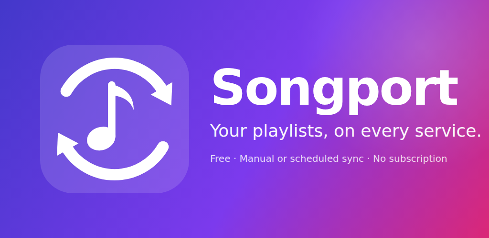

# Songport



Android app that keeps playlists in sync across music services, manually or on a schedule.
Free, no account, no subscription: a single banner ad pays for development. Everything runs on the
phone; there is no Songport server and access tokens never leave the device.

Supported: Spotify, Apple Music, YouTube Music, TIDAL (beta), Deezer (beta), Subsonic/Navidrome,
Jellyfin, Plex, Last.fm and ListenBrainz (read-only), plus playlist files (CSV, TSV, M3U, iTunes XML,
JSON, pasted text) as a bridge to everything else.

The rest of this document is in Italian. UI strings are in Italian and English.
License: GPL-3.0, see [LICENSE](LICENSE). Security reports: see [SECURITY.md](SECURITY.md).

---

## Indice
- [Funzionalità](#funzionalità)
- [Servizi supportati e limiti](#servizi-supportati-e-limiti)
- [Come funziona l'abbinamento dei brani](#come-funziona-labbinamento-dei-brani)
- [Sicurezza degli accessi](#sicurezza-degli-accessi)
- [Architettura](#architettura)
- [Struttura del progetto](#struttura-del-progetto)
- [Compilare](#compilare)
- [Configurazione delle API](#configurazione-delle-api)
- [Pubblicità, consenso e donazioni](#pubblicità-consenso-e-donazioni)
- [Pubblicazione su Google Play](#pubblicazione-su-google-play)
- [Contribuire](#contribuire)
- [Limiti noti](#limiti-noti)

---

## Funzionalità

| Area | Funzione | Note |
|------|----------|------|
| Sync | Origine → destinazione tra due servizi qualsiasi | Anche stesso servizio (copia playlist). |
| | Playlist esistente o creazione automatica della destinazione | La destinazione creata è privata. |
| | Manuale ("Esegui", "Sincronizza tutto") | Le sync manuali girano in primo piano con notifica di avanzamento. |
| | Programmata: ogni ora, 6 ore, giorno, settimana | WorkManager, sopravvive ai riavvii; opzione "solo Wi-Fi". |
| | Solo aggiunte (default) oppure rispecchia le rimozioni | Le rimozioni sono saltate se l'origine risulta vuota. |
| | Bidirezionale | Un interruttore crea la sync gemella al contrario, senza rimozioni; le due sync si eliminano insieme. |
| | "Brani preferiti" come origine o destinazione | Spotify, Deezer, Subsonic, Jellyfin, Last.fm, ListenBrainz. |
| Anteprima | Cosa cambierebbe, prima di farlo | Già presenti, da aggiungere, da rimuovere, non trovati, incerti. |
| Abbinamento | ISRC, poi titolo + artista + durata | Cache degli abbinamenti; penalizza live, karaoke, cover, sped up quando l'originale non lo è. |
| Revisione | Abbinamenti incerti da confermare | Sotto l'86% di somiglianza l'abbinamento è accettato ma segnalato; si conferma o si cambia. |
| Non trovati | Correzione manuale | Ricerca libera sulla destinazione, scelta del risultato, oppure "ignora". |
| Ripristino | Rimette i brani tolti da una sync a specchio | Dal registro. |
| Quota YouTube | Anello con le unità usate oggi | Ricerca 100, scrittura 50 su 10.000 al giorno; l'app mostra quanto resta e quanto costerà la sync. |
| Account multipli | Più account dello stesso servizio | Anche per migrare fra due account. |
| Strumenti | Backup completo di un servizio | Playlist e preferiti in file locali, esportabili in CSV/M3U. |
| | Rimozione duplicati | Stesso brano anche con id o versione diversa; tiene la prima copia. |
| Link | Incolla o condividi il link di una playlist pubblica | Spotify, Apple Music, YouTube, Deezer, TIDAL. |
| File | Import/export | Legge CSV, TSV, M3U/M3U8, XML Apple Music/iTunes, JSON, elenchi di testo; scrive CSV e M3U. |
| Widget e scorciatoie | Widget home e pressione lunga sull'icona | Ultima sync, "Sincronizza tutto", "Nuova sync". |
| Diagnostica | "Condividi dettagli tecnici" nel registro | Versione, dispositivo, servizi, ultime esecuzioni, log degli errori; nessun token. |
| Sicurezza | Foglio informativo prima di ogni login, token cifrati, blocco con impronta o PIN | Vedi [Sicurezza degli accessi](#sicurezza-degli-accessi). |
| Lingue | Italiano e inglese | |

## Servizi supportati e limiti

| Servizio | Stato | Login | Cosa serve alla build | Limiti |
|----------|-------|-------|-----------------------|--------|
| Spotify | completo | OAuth PKCE nel browser | `SPOTIFY_CLIENT_ID`, redirect `songport://callback` | Un'app in *Development Mode* accetta 5 utenti e il proprietario deve avere Spotify Premium (regole di febbraio 2026). L'*Extended Quota Mode* richiede un'azienda registrata e 250.000 utenti attivi mensili. Dal luglio 2026 la quota è conteggiata per account sviluppatore, non per client ID. Per questo l'app guida ogni utente a creare il proprio client ID: su Spotify è il percorso normale. |
| Apple Music | lettura e aggiunta | MusicKit JS in una WebView dell'app | `APPLE_DEVELOPER_TOKEN` (JWT ES256, Apple Developer Program) | L'API non permette di togliere brani da una playlist: le sync a specchio aggiungono soltanto e lo segnalano. Il developer token scade al massimo dopo 6 mesi. Serve un abbonamento Apple Music. I brani della libreria non espongono l'ISRC. |
| YouTube Music | via YouTube Data API v3 | OAuth Google | `GOOGLE_CLIENT_ID` (client OAuth Android: package + SHA-1), YouTube Data API abilitata, verifica OAuth per lo scope `youtube` | Quota 10.000 unità al giorno per progetto (ricerca 100, inserimento 50), condivisa da tutti gli utenti della stessa build. Con credenziali proprie la quota è quella dell'utente. Nessun ISRC. |
| TIDAL | beta | OAuth PKCE | `TIDAL_CLIENT_ID` | API v2 (JSON:API) in evoluzione; endpoint isolati in `TidalProvider.kt`. Non provato dal vivo. |
| Deezer | beta | OAuth implicit | `DEEZER_APP_ID` e una pagina https di redirect (`docs/deezer-redirect.html`) | La registrazione di nuove app potrebbe essere chiusa. Le playlist lette non hanno ISRC. Non provato dal vivo. |
| Subsonic / Navidrome (Airsonic, Gonic, LMS, Funkwhale) | completo | indirizzo, utente, password (token md5+salt) | niente | Brani con stella = preferiti. |
| Jellyfin | completo | indirizzo, utente, password | niente | Preferiti supportati. |
| Plex | senza creazione playlist | indirizzo e X-Plex-Token | niente | L'API non crea playlist vuote: si crea in Plex e si sceglie in app. |
| Last.fm | sola lettura | nome utente | `LASTFM_API_KEY` oppure chiave inserita dall'utente | Solo brani amati, solo come origine. |
| ListenBrainz | sola lettura | nome utente | niente | Playlist e brani amati, solo come origine. |
| File | completo | | | Import/export dal selettore file di sistema, oppure "Incolla un elenco". |
| Amazon Music, Qobuz, SoundCloud, Pandora | non collegabili | | | API riservate a partner o in beta chiusa. Si passa dai file. |

Le credenziali personali si inseriscono da *Account → scheda del servizio → Usa le tue credenziali*:
passi numerati, link al portale, redirect da copiare, verifica con un login reale.

Caso Google/YouTube: un client OAuth di tipo *Android* è legato alla firma dell'APK, quindi non è
sovrascrivibile dall'utente. Con credenziali proprie l'app usa il flusso *installed app*: client di
tipo *Desktop* e redirect su `http://127.0.0.1:<porta>`, dove l'app apre un server in ascolto solo su
loopback per la durata dell'autorizzazione (`auth/LoopbackServer.kt`).

Apple Music funziona senza backend perché Apple offre MusicKit JS: l'app apre una WebView su una
pagina servita dai propri asset (origine https reale tramite `WebViewAssetLoader`), MusicKit gestisce
l'accesso Apple ID e restituisce il *music user token*. Amazon Music non ha un equivalente aperto.

## Come funziona l'abbinamento dei brani

`sync/Matcher.kt` è Kotlin puro e coperto da test:

1. ISRC identico → stesso brano (punteggio 1.0). Spotify, TIDAL e Deezer lo espongono.
2. Altrimenti titolo normalizzato (minuscolo, senza accenti, senza `(feat. …)`, `- Remastered 2011`,
   `[Official Video]`; "remix" viene mantenuto) confrontato con Levenshtein e Jaccard sui token;
   artisti confrontati tra loro; durata come fattore (±3 s pieno, oltre 25 s forte penalità).
   Soglia 0.70 per i risultati di ricerca, 0.82 per riconoscere i brani già presenti, 0.86 sotto la
   quale l'abbinamento è segnalato come incerto.
3. Per YouTube i titoli video vengono spezzati in artista/titolo (`sync/TitleParser.kt`).
4. Ogni abbinamento finisce in una cache locale (`Store.matchCache`, massimo 20.000 voci).

## Sicurezza degli accessi

- La password si digita sul sito del servizio (Custom Tab con barra dell'indirizzo visibile) o nella
  finestra ufficiale Apple. Per i server personali le credenziali restano sul telefono.
- L'app riceve solo un token revocabile, cifrato con `EncryptedSharedPreferences` (chiave
  nell'Android Keystore), escluso dal backup. Scollegare lo cancella; ogni scheda ha il link alla pagina
  di revoca del servizio.
- Nessun server intermedio: le richieste vanno dal telefono ai servizi collegati.
- Prima di ogni "Collega" un foglio mostra il dominio che si aprirà e cosa riceve l'app.
- Blocco opzionale con impronta, volto o PIN all'apertura (`BiometricPrompt`).
- Nessuna chiave o segreto nel repository: client ID, developer token, ID AdMob e chiavi di firma
  arrivano dalla build (variabili e secret di GitHub Actions).

## Architettura

```
MainActivity (tab: Sync, Account, Strumenti, Registro, Impostazioni)          AdBanner (AdMob + UMP)
    │
    ├── SyncEditor / Preview / Review ──▶ Store (store.json: job, report, cache abbinamenti, impostazioni)
    │
    └── Scheduler (WorkManager: periodico per job, one-shot "esegui ora") ──▶ SyncWorker ──▶ SyncEngine
                                                                                          │
                                                        MusicProvider (interfaccia, un'istanza per account)
                                                        Spotify · AppleMusic · YouTube · Tidal · Deezer
                                                        Subsonic · Jellyfin · Plex · LastFm · ListenBrainz · LocalFiles
                                                                                          │
AuthFlow (PKCE, loopback) · AppleAuthActivity (MusicKit JS) · ServerLoginActivity · TokenStore (cifrato)
                                                                                          ▼
                                             API ufficiali dei servizi, chiamate direttamente dal telefono
```

## Struttura del progetto

```
Songport/
├── README.md, LICENSE, SECURITY.md
├── docs/
│   ├── privacy-policy.md          # informativa (IT + EN) da pubblicare e linkare nel Play Store
│   ├── play-store-listing.md      # testi scheda store, risposte "Sicurezza dei dati", checklist
│   ├── deezer-redirect.html       # pagina https → songport://callback
│   └── store/                     # icona 512×512 e grafica in evidenza 1024×500 (it/en)
└── android/
    ├── build.gradle, settings.gradle, gradle.properties
    └── app/
        ├── build.gradle           # parametri build: client ID, AdMob, firma release da env/secrets
        ├── proguard-rules.pro
        └── src/
            ├── main/AndroidManifest.xml
            ├── main/java/com/xlollx/songport/
            │   ├── MainActivity.kt, SongportApp.kt, Notifications.kt
            │   ├── ads/Ads.kt                 # consenso UMP + banner adattivo
            │   ├── auth/                      # Pkce, AuthFlow, AuthCallbackActivity, AppleAuthActivity, LoopbackServer, ServerLoginActivity, LockActivity
            │   ├── data/                      # Store (JSON, scritture coalescenti), TokenStore (cifrato), Diagnostics
            │   ├── model/Models.kt            # Track, Playlist, SyncJob, SyncReport, SyncPlan
            │   ├── net/                       # Http (OkHttp, retry 429), helper JSON
            │   ├── providers/                 # MusicProvider e le implementazioni
            │   ├── sync/                      # Matcher, Duplicates, TitleParser, CsvCodec, PlaylistFiles, PlaylistLinks, SyncEngine, Tools, Scheduler, QuotaMeter
            │   ├── ui/                        # schermate Compose e componenti condivisi (Common.kt, Theme.kt)
            │   └── widget/SyncWidget.kt
            ├── main/assets/applemusic/auth.html  # pagina MusicKit JS per il login Apple Music
            ├── main/res/values(-it)/strings.xml
            └── test/…/sync/                   # test JUnit (matcher, parser, CSV, link)
```

## Compilare

Requisiti: JDK 17, Android SDK con platform 36. Da `android/`:

```bash
gradle testDebugUnitTest      # test unitari (Kotlin puro, senza emulatore)
gradle assembleDebug          # APK in app/build/outputs/apk/debug/
```

Oppure aprire `android/` in Android Studio. Senza variabili di build i servizi OAuth compaiono come
"Non configurato" e si usano con credenziali proprie inserite in app; file e server personali
funzionano sempre.

Toolchain: AGP 8.11.1, Gradle 8.14.3, Kotlin 2.1.21, compileSdk/targetSdk 36, minSdk 26.

### GitHub Actions

`.github/workflows/build.yml` parte a ogni push su `main`, sulle pull request e a mano. Esegue i test,
produce l'APK di debug e, se sono presenti i secret della chiave di upload, l'AAB firmato. Con il secret
`DEBUG_KEYSTORE_BASE64` (un keystore di debug in base64) la firma dell'APK debug resta uguale tra le
build e gli aggiornamenti si installano sopra; il file non è nel repository.

## Configurazione delle API

I client ID non sono nel codice: arrivano dalla build (*Settings → Secrets and variables → Actions*) e,
per Spotify, TIDAL, Deezer, Google e Last.fm, possono essere inseriti dall'utente in app.

| Variabile | Dove ottenerla | Redirect URI da registrare |
|-----------|----------------|-----------------------------|
| `SPOTIFY_CLIENT_ID` | developer.spotify.com → Dashboard → Create app (Web API) | `songport://callback` |
| `GOOGLE_CLIENT_ID` | console.cloud.google.com → Credenziali → client OAuth Android (package `com.xlollx.songport` + SHA-1 della firma di rilascio). Abilitare YouTube Data API v3, configurare la schermata di consenso, richiedere la verifica per lo scope `youtube`. | automatico (schema `com.googleusercontent.apps.<id>`) |
| `APPLE_DEVELOPER_TOKEN` (secret) | Apple Developer → Keys → MusicKit → chiave `.p8`, Key ID e Team ID, poi il JWT qui sotto | nessuno |
| `TIDAL_CLIENT_ID` | developer.tidal.com → Dashboard → Create app | `songport://callback` |
| `DEEZER_APP_ID`, `DEEZER_REDIRECT_URL` | developers.deezer.com → My Apps. Pubblicare `docs/deezer-redirect.html` su un host https e usare quell'URL come redirect e "Application domain". | l'URL https della pagina |
| `LASTFM_API_KEY` | last.fm/api/account/create | nessuno |
| `ADMOB_APP_ID`, `ADMOB_BANNER_ID` | AdMob | |
| `PRIVACY_POLICY_URL`, `KOFI_URL` | URL pubblici dell'informativa e della pagina donazioni; `KOFI_URL` vuoto nasconde il pulsante | |

Se il repository è pubblico, registrare nel client OAuth Google solo la SHA-1 della chiave di upload e
di Play App Signing, non quella di debug.

Generare il developer token Apple Music (scade al massimo dopo 6 mesi):

```bash
pip install pyjwt cryptography
python - <<'PY'
import jwt, time
KEY_ID, TEAM_ID, P8 = "ABCD123456", "TEAM123456", "AuthKey_ABCD123456.p8"
print(jwt.encode({"iss": TEAM_ID, "iat": int(time.time()), "exp": int(time.time()) + 15777000},
                 open(P8).read(), algorithm="ES256", headers={"kid": KEY_ID}))
PY
```

## Pubblicità, consenso e donazioni

- Un solo banner adattivo in fondo alla schermata principale (`ads/Ads.kt`). Niente interstitial, video
  o annunci a schermo intero.
- Prima di caricare annunci l'app chiede il consenso con Google UMP; senza consenso non richiede
  annunci. In *Impostazioni* compare "Opzioni privacy annunci" dove la normativa lo richiede.
- Di default la build usa gli ID di test di Google. Non testare mai con ID reali.
- Al primo avvio una scheda spiega perché ci sono le pubblicità e offre un pulsante verso una pagina di
  donazioni (Ko-fi). La donazione è volontaria e non sblocca nulla, quindi resta fuori dalla fatturazione
  Google Play. Lo stesso pulsante è in *Impostazioni*.

## Pubblicazione su Google Play

1. Chiave di upload (mai nel repository):
   ```bash
   keytool -genkeypair -v -keystore upload.jks -alias upload -keyalg RSA -keysize 2048 -validity 10000
   base64 -w0 upload.jks   # contenuto del secret UPLOAD_KEYSTORE_BASE64
   ```
   Secret: `UPLOAD_KEYSTORE_BASE64`, `UPLOAD_KEYSTORE_PASSWORD`, `UPLOAD_KEY_ALIAS`, `UPLOAD_KEY_PASSWORD`.
   Con Play App Signing va registrata nel client OAuth Google anche la SHA-1 di Play.
2. Variabili: client ID dei servizi, `ADMOB_APP_ID`, `ADMOB_BANNER_ID`, `PRIVACY_POLICY_URL`, `KOFI_URL`.
3. Aggiornare `versionCode` e `versionName` in `app/build.gradle` a ogni release.
4. Play Console: dichiarare gli annunci, compilare *Sicurezza dei dati* e la dichiarazione sui servizi
   in primo piano (tipo `dataSync`, avviato dall'utente); l'informativa è in `docs/privacy-policy.md`.
   Testi, risposte e checklist in `docs/play-store-listing.md`.
5. Non usare loghi ufficiali dei servizi nell'icona o negli screenshot; nella descrizione i nomi si
   citano solo per indicare la compatibilità.

## Contribuire

Segnalazioni e pull request sono benvenute. Per un nuovo servizio: implementare `MusicProvider`
(o estendere `OAuthProvider` / `CredentialsProvider`), registrarlo in `Providers.configure`, aggiungere
le stringhe in entrambe le lingue e, se serve, un test in `src/test`. Prima di aprire una pull request
eseguire `gradle testDebugUnitTest`. Le vulnerabilità vanno segnalate come descritto in
[SECURITY.md](SECURITY.md), non in una issue pubblica.

## Limiti noti

- TIDAL e Deezer sono scritti sulle API documentate ma non provati dal vivo.
- YouTube: quota giornaliera condivisa fra gli utenti della stessa build; il parsing dei titoli video
  non è perfetto (i dubbi finiscono fra i non trovati, mai aggiunti a caso).
- Spotify: con il client ID della build solo 5 utenti; ogni utente deve usare il proprio.
- Apple Music: si aggiunge ma non si rimuove; il developer token va rigenerato ogni 6 mesi.
- Amazon Music, Qobuz, SoundCloud: nessuna API aperta, solo file.
- Frequenza minima offerta: 1 ora (WorkManager permetterebbe 15 minuti, ma le quote API no).
- Le sync programmate girano sul telefono: alcuni produttori fermano le app in secondo piano.
  In *Impostazioni* c'è il pulsante per escludere l'app dal risparmio energetico.
