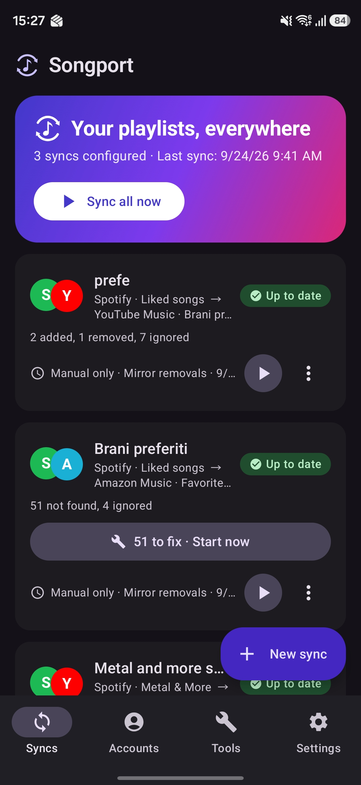
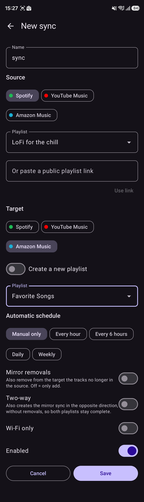
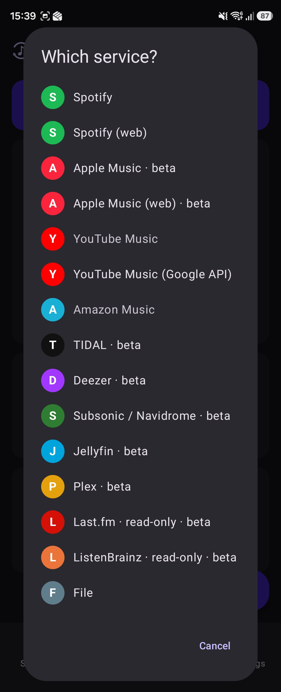
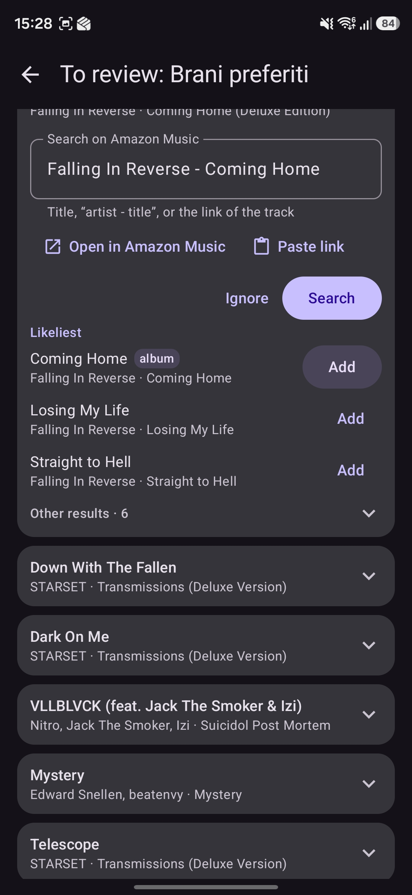
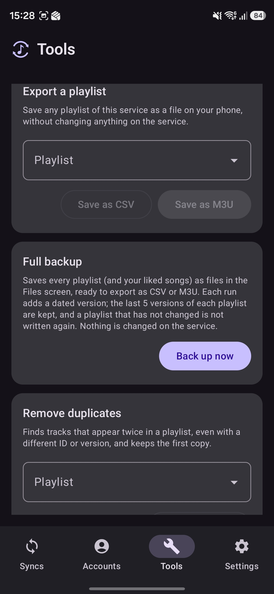
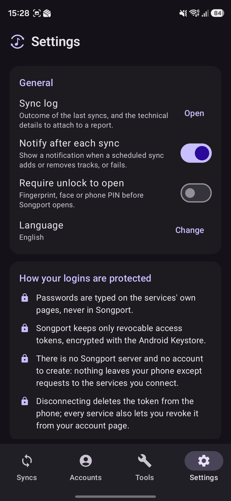

# Songport


<p align="center">     </p>

Android app that keeps playlists in sync across music services, manually or on a schedule.
Free, no account, no subscription, and no ads in the GitHub build: development lives on voluntary
donations. Everything runs on the phone. There is no Songport server and access tokens never leave the device.

Supported: Spotify, Apple Music, YouTube Music, Amazon Music, TIDAL, Deezer, Subsonic/Navidrome,
Jellyfin, Plex, Last.fm and ListenBrainz (read-only), plus playlist files (CSV, TSV, M3U, iTunes XML,
JSON, pasted text) as a bridge to everything else.

Apple Music, TIDAL, Deezer, the personal servers, Last.fm and ListenBrainz are marked **beta** in the
app: they are written against each service's documented API and work, but they have had far less
real-world use than the rest, so a report about them is especially welcome.

The app ships without any service credentials of its own: each user creates a free developer key
on the services that require one (Spotify, YouTube Music, TIDAL, Deezer, Last.fm) and the app walks
them through it in about two minutes. Personal servers and files need nothing.

Download: the signed APK of every version is on the
[Releases](https://github.com/xlollx/Songport/releases/latest) page. UI languages: English, Italian,
French, German, Spanish, Chinese and Japanese. License: GPL-3.0, see [LICENSE](LICENSE). Security reports: see
[SECURITY.md](SECURITY.md).

<a href="https://apps.obtainium.imranr.dev/redirect?r=obtainium://add/https://github.com/xlollx/Songport"></a>

With [Obtainium](https://github.com/ImranR98/Obtainium) each new release reaches the phone by itself:
tap the badge on the phone, or add `https://github.com/xlollx/Songport` in Obtainium.

---

## Public beta

Songport is in **open beta**: the features are complete and used daily by the developer, and now
they need other libraries, phones and habits. Everything you meet is meant to work; if it does not,
that is exactly what to report.

- **Install**: the signed APK from the [Releases](https://github.com/xlollx/Songport/releases/latest)
  page (updates install over it), or F-Droid once listed there. This build includes YouTube Music,
  Amazon Music and the Spotify/Apple Music web sign-in; no second app is needed.
- **What helps most**: the connectors marked *beta* in Accounts, a sync of a big playlist (a thousand tracks and more), the review of the tracks
  that were not found (one-tap proposals, the "likeliest" list, pasting a track link), scheduled syncs
  surviving the night, and backups of a whole account.
- **How to report**: open an [issue](https://github.com/xlollx/Songport/issues/new/choose) and attach
  the **technical details report** (Settings → *Sync log* → *Share technical details*): versions, connectors, the
  last sync steps and plugin statistics, never tokens or track lists. Italian is welcome.
- **Known rough edges**: see [Known limits](#known-limits). Matching depends on each catalogue's search:
  a track "not found" is usually missing or titled differently on the destination, and the review
  screen exists for those.

---

## Contents
- [Public beta](#public-beta)
- [Features](#features)
- [Supported services and their limits](#supported-services-and-their-limits)
- [Connector plugins](#connector-plugins)
- [How tracks are matched](#how-tracks-are-matched)
- [How logins are protected](#how-logins-are-protected)
- [Architecture](#architecture)
- [Project layout](#project-layout)
- [Building](#building)
- [API configuration](#api-configuration)
- [Ads, consent and donations](#ads-consent-and-donations)
- [Publishing on Google Play](#publishing-on-google-play)
- [Contributing](#contributing)
- [License, copyright and trademark](#license-copyright-and-trademark)
- [Known limits](#known-limits)
- [Roadmap](docs/ROADMAP.md)

---

## Features

| Area | Feature | Notes |
|------|---------|-------|
| Sync | Source → target between any two services | Same service too (playlist copy). |
| | Existing playlist or automatic creation of the target | Created playlists are private. |
| | Manual ("Run", "Sync all") | Manual syncs run as a foreground job with a progress notification. |
| | Scheduled: hourly, every 6 hours, daily, weekly | WorkManager, survives reboots; "Wi-Fi only" option. |
| | Additions only (default) or mirror removals | Removals are skipped when the source comes back empty. |
| | Bidirectional | One switch creates the reverse twin sync without removals; the two are deleted together. |
| | "Liked songs" as source or target | Spotify, Deezer, Subsonic, Jellyfin, Last.fm, ListenBrainz. |
| | Saved albums, followed artists, podcasts | Sync or transfer them like a playlist (Spotify, Deezer, Subsonic/Navidrome, Jellyfin; Apple Music albums, add only). Matched by UPC where available, then title and artist; the review works the same. YouTube Music and TIDAL not yet. |
| Preview | What would change, before doing it | Already present, to add, to remove, not found, uncertain. |
| Matching | ISRC, then title + artist + duration | Match cache; penalises live, karaoke, cover and sped-up versions when the original is not one. |
| Review | Uncertain matches to confirm | Below 86% similarity a match is accepted but flagged; confirm or replace it. |
| Not found | Manual fix | Free search on the target, pick the result, or "ignore". |
| Restore | Put back tracks removed by a mirror sync | From the log. |
| YouTube quota | Ring with the units used today | Search 100, write 50 out of 10,000 per day; the app shows what is left and what a sync will cost. |
| Multiple accounts | Several accounts of the same service | Also for migrating between two accounts. |
| Tools | Playlist generator (beta) | Describe a playlist; your own AI (OpenAI, Anthropic, Gemini or any OpenAI-compatible server, even local) proposes the tracks, Songport finds them on the chosen service through a normal sync. The proposal is reviewed before anything is created, the sync is marked with a spark and can be extended later with more AI picks. No AI of Songport's: your key, stored encrypted; only the text you type is sent. |
| | Manage playlists | Your playlists on a service in one list: rename, delete (where the API allows it: Spotify, YouTube, YouTube Music, Deezer, TIDAL, Subsonic, Jellyfin, Plex, files) and export. |
| | Batch transfer | Pick many playlists of one service and send them all to another: one sync each, run one after the other, kept in Syncs. |
| | Playlist tools | Copy, merge (skipping duplicates), split into parts, sort by artist/title/album/year/date added/duration, shuffle; always into a new playlist, the originals untouched. |
| | Repeats across playlists | Tracks in more than one playlist and liked songs in no playlist, per service; each list can become a file. |
| | Backup to a folder | The dated backups also copied to a folder you pick (SD card, Nextcloud, Drive…), daily or weekly. |
| | Full backup of a service | Playlists and likes into local files, with dated versions. |
| | Duplicate removal | Same track even with a different id or version; keeps the first copy. |
| Links | Paste or share a public playlist link | Spotify, Apple Music, YouTube, Deezer, TIDAL. |
| Files | Import/export | Reads CSV, TSV, M3U/M3U8, XSPF, JSPF, OPML (podcasts), Apple Music/iTunes XML, JSON, Shazam exports, plain text lists; writes CSV, M3U, XSPF, JSPF and plain text. |
| | setlist.fm | Share or paste a setlist.fm link: the concert becomes a playlist to sync anywhere. |
| Widget and shortcuts | Home widget and long-press on the icon | Last sync, "Sync all", "New sync". |
| Diagnostics | "Share technical details" in the log | Version, device, services, last runs, error log; no tokens. |
| Security | Info sheet before every login, encrypted tokens, fingerprint or PIN lock | See [How logins are protected](#how-logins-are-protected). |

## Supported services and their limits

| Service | Status | Login | What the build needs | Limits |
|---------|--------|-------|----------------------|--------|
| Spotify | complete | OAuth PKCE in the browser | `SPOTIFY_CLIENT_ID`, redirect `songport://callback` | An app in *Development Mode* accepts 5 users and its owner needs Spotify Premium (February 2026 rules). *Extended Quota Mode* requires a registered company and 250,000 monthly active users. Since July 2026 the quota is counted per developer account, not per client ID. That is why the app walks each user through creating their own client ID: on Spotify this is the normal path. |
| Apple Music | read and add, beta | MusicKit JS in an in-app WebView | `APPLE_DEVELOPER_TOKEN` (ES256 JWT, Apple Developer Program) | The API cannot remove tracks from a playlist: mirror syncs towards Apple Music only add and say so in the report. The developer token expires after at most 6 months. An Apple Music subscription is required. Library tracks do not expose an ISRC. |
| YouTube Music | built into the GitHub/F-Droid build; in the Play build via the [Songport Bridge](https://github.com/xlollx/Songport-YTM-Bridge) | Google sign-in on Google's page | nothing: the Bridge is installed separately, outside Google Play | Uses the web player's internal interface: not an official API, against the YouTube Terms of Service, may break without notice. No quota. The Bridge shows the notice before sign-in. |
| YouTube Music (Google API) | via YouTube Data API v3 | Google OAuth | `GOOGLE_CLIENT_ID` (Android OAuth client: package + SHA-1), YouTube Data API enabled, OAuth verification for the `youtube` scope | 10,000 units per day per project (search 100, insert 50), shared by every user of the same build. With own credentials the quota is the user's. No ISRC. |
| Spotify (web) | complete, built in (GitHub/F-Droid) or via the [Songport Bridge](https://github.com/xlollx/Songport-YTM-Bridge) | Spotify sign-in on Spotify's page | nothing | The Bridge captures the web player's short-lived Web API token and hands it to Songport, which then runs the same Spotify code as above. Not an official route, against Spotify's terms, may break without notice. |
| Apple Music (web) | read and add, built in (GitHub/F-Droid) or via the Songport Bridge | Apple ID sign-in on Apple's page | nothing | The Bridge reads the web player's developer token and the music user token cookie; Songport then runs the same Apple Music code as above. Not an official route, against Apple's terms, may break without notice. |
| Amazon Music | complete, built in (GitHub/F-Droid) or via the [Songport Bridge](https://github.com/xlollx/Songport-YTM-Bridge) | Amazon sign-in on Amazon's page | nothing | Amazon's official Web API is a closed beta for approved partners, so the Bridge uses the web player's interface (library playlists, playlist rows with their entry ids, search, create, add, remove). Not an official API, may break without notice. |
| TIDAL | beta | OAuth PKCE | `TIDAL_CLIENT_ID` | API v2 (JSON:API) still evolving; endpoints isolated in `TidalProvider.kt`. Beta: limited real-world use. |
| Deezer | beta | OAuth implicit | `DEEZER_APP_ID` and an https redirect page (`docs/deezer-redirect.html`) | Registration of new apps may be closed. Playlists read from Deezer carry no ISRC. Beta: limited real-world use. |
| Subsonic / Navidrome (Airsonic, Gonic, LMS, Funkwhale) | complete, beta | server URL, user, password (md5+salt token) | nothing | Starred tracks = likes. |
| Jellyfin | complete, beta | server URL, user, password | nothing | Favourites supported. |
| Plex | no playlist creation, beta | server URL and X-Plex-Token | nothing | The API does not create empty playlists: create it in Plex and pick it in the app. |
| Last.fm | read-only, beta | username | `LASTFM_API_KEY` or a key entered by the user | Loved tracks only, source only. |
| ListenBrainz | read-only, beta | username | nothing | Playlists and loved tracks, source only. |
| Files | complete | | | Import/export through the system file picker, or "Paste a list". |
| Qobuz, SoundCloud, Pandora | not connectable | | | Partner-only or closed-beta APIs. Use files. |

Own credentials are entered from *Accounts → service card → Use your own credentials*: numbered
steps, link to the developer portal, redirect URI to copy, verification with a real login.

Google/YouTube: an *Android* OAuth client is tied to the APK signature, so the user cannot override
it. With own credentials the app switches to the *installed app* flow: a *Desktop* client and a
redirect to `http://127.0.0.1:<port>`, where the app listens on loopback only for the duration of the
authorisation (`auth/LoopbackServer.kt`).

Apple Music works without a backend because Apple provides MusicKit JS: the app opens a WebView on a
page served from its own assets (a real https origin through `WebViewAssetLoader`), MusicKit handles
the Apple ID sign-in and returns the *music user token*. Amazon Music has no open equivalent, which is
why it is offered through a connector plugin.

## Connector plugins

Some services have no open API, and on others the official route is heavy for a single user: a
developer account to register, a paid program, a daily quota to share. For those, Songport defines an
**open connector interface**: a separate app, a *plugin*, holds the sign-in to a service and answers
Songport's requests for playlists and tracks.

The Google Play build never includes, downloads or installs a plugin. It discovers one that the user
has already installed and then offers its services in the account picker, next to the official
routes, which stay available and unchanged. The GitHub and F-Droid build carries the reference
plugin's connectors inside instead (see below), so it needs no second app.

### How discovery works

A plugin declares an activity handling the intent action `com.xlollx.songport.action.CONNECTOR`, with
a `<meta-data>` entry named `com.xlollx.songport.connector.authority` holding the authority of its
`ContentProvider`. Songport queries that action (`providers/BridgePlugin.kt`), then calls the provider
with `ContentResolver.call()`; each provider in `providers/*BridgeProvider.kt` maps those calls onto
the usual `MusicProvider` interface, so the sync engine treats a plugin service like any other. The
plugin must verify the caller's package name and signing certificate before answering.

### Songport Bridge and the built-in web connectors

[**Songport Bridge**](https://github.com/xlollx/Songport-YTM-Bridge) is the reference plugin, by the
same author, free and open source (GPL-3.0), distributed on GitHub only and never on Google Play.
Its connectors are also built into Songport's GitHub and F-Droid build, as the `:bridge` library module
(`android/bridge`, included with `fullImplementation`): the same code runs inside Songport, called
in-process through `BridgeCore` instead of a ContentProvider (`providers/BuiltIn.kt` in `src/full`,
an empty twin in `src/play`). The separate Bridge app stays for the Play build. The connectors add:

| Service | What it adds |
|---------|--------------|
| YouTube Music | playlists, liked songs, search and writing without a Google Cloud project and without quota |
| Amazon Music | the only way to connect it: Amazon's Web API is a closed beta for approved partners |
| Spotify | sign-in without registering a developer app |
| Apple Music | sign-in without the Apple Developer Program |

It works by using the same web interfaces the services' own players use. That is against those
services' terms of use, it can stop working whenever a service changes something, and in the worst
case a service could restrict the account signed in. A disclaimer asks for acceptance before the
first sign-in, in the Bridge and in the built-in connectors alike. Passwords are typed only on the
services' own pages and are never seen or stored; the session cookies stay encrypted on the phone,
and the sync engine gets only data or short-lived tokens.

User-facing page: [xlollx.github.io/Songport/plugins](https://xlollx.github.io/Songport/plugins).

### Two distributions of Songport

The `play` flavor, the one for Google Play, never names, links to or describes any plugin; plugin
services appear only when a plugin is already installed, with generic wording, and it contains no
code that uses unofficial interfaces. The `full` flavor, the APK on GitHub Releases and on F-Droid,
has the web connectors built in and no ads. See
[Publishing on Google Play](#publishing-on-google-play).

## How tracks are matched

`sync/Matcher.kt` is plain Kotlin and covered by tests:

1. Identical ISRC → same track (score 1.0). Spotify, TIDAL and Deezer expose it.
2. Otherwise the normalised title (lowercase, no accents, without `(feat. …)`, `- Remastered 2011`,
   `[Official Video]`; "remix" is kept) is compared with Levenshtein and token Jaccard; artists are
   compared with each other; duration is a factor (±3 s full, beyond 25 s strong penalty).
   Threshold 0.70 for search results, 0.82 to recognise tracks already in the target, 0.86 below
   which a match is flagged as uncertain.
3. YouTube video titles are split into artist/title (`sync/TitleParser.kt`).
4. Every match goes into a local cache (`Store.matchCache`, up to 20,000 entries).

## How logins are protected

- The password is typed on the service's own site (Custom Tab with a visible address bar) or in
  Apple's official window. Personal server credentials stay on the phone.
- The app only receives a revocable token, encrypted with `EncryptedSharedPreferences` (key in the
  Android Keystore) and excluded from backups. Disconnecting deletes it; every card links to the
  service's revocation page.
- No intermediate server: requests go from the phone to the connected services.
- Before every "Connect" a sheet shows the domain that will open and what the app receives.
- Optional fingerprint, face or PIN lock on launch (`BiometricPrompt`).
- No key or secret in the repository: client IDs, developer token, AdMob IDs and signing keys come
  from the build (GitHub Actions variables and secrets).

## Architecture

```
MainActivity (tabs: Syncs, Accounts, Tools, Log, Settings)                      AdBanner (AdMob + UMP)
    │
    ├── SyncEditor / Preview / Review ──▶ Store (store.json: jobs, reports, match cache, settings)
    │
    └── Scheduler (WorkManager: periodic per job, one-shot "run now") ──▶ SyncWorker ──▶ SyncEngine
                                                                                        │
                                                       MusicProvider (interface, one instance per account)
                                                       Spotify · AppleMusic · YouTube · Tidal · Deezer
                                                       Subsonic · Jellyfin · Plex · LastFm · ListenBrainz · LocalFiles
                                                                                        │
AuthFlow (PKCE, loopback) · AppleAuthActivity (MusicKit JS) · ServerLoginActivity · TokenStore (encrypted)
                                                                                        ▼
                                             Official service APIs, called directly from the phone
```

## Project layout

```
Songport/
├── README.md, LICENSE, SECURITY.md
├── docs/
│   ├── privacy-policy.md          # privacy policy (EN + IT) to publish and link in the Play listing
│   ├── play-store-listing.md      # store texts, Data safety answers, release checklist
│   ├── deezer-redirect.html       # https page → songport://callback
│   ├── google-shared-client.md    # shipping a shared Google client: verification and quota
│   └── store/                     # 512×512 icon and 1024×500 feature graphic (en/it)
└── android/
    ├── build.gradle, settings.gradle, gradle.properties
    └── app/
        ├── build.gradle           # build parameters: client IDs, AdMob, release signing from env/secrets
        ├── proguard-rules.pro
        └── src/
            ├── main/AndroidManifest.xml
            ├── main/java/com/xlollx/songport/
            │   ├── MainActivity.kt, SongportApp.kt, Notifications.kt
            │   ├── ai/AiClient.kt             # Playlist generator: the user's own AI provider (OpenAI-compatible, Anthropic, Gemini)
            │   ├── ads/Ads.kt                 # UMP consent + adaptive banner
            │   ├── auth/                      # Pkce, AuthFlow, AuthCallbackActivity, AppleAuthActivity, LoopbackServer, ServerLoginActivity, LockActivity
            │   ├── data/                      # Store (JSON, coalesced writes), TokenStore (encrypted), Diagnostics
            │   ├── model/Models.kt            # Track, Playlist, SyncJob, SyncReport, SyncPlan
            │   ├── net/                       # Http (OkHttp, 429 retry), JSON helpers
            │   ├── providers/                 # MusicProvider and its implementations
            │   ├── sync/                      # Matcher, Duplicates, TitleParser, CsvCodec, PlaylistFiles, PlaylistLinks, SyncEngine, Tools, Scheduler, QuotaMeter
            │   ├── ui/                        # Compose screens and shared components (Common.kt, Theme.kt)
            │   └── widget/SyncWidget.kt
            ├── main/assets/applemusic/auth.html  # MusicKit JS page for the Apple Music login
            ├── main/res/values(-it,-fr,-de,-es,-zh,-ja)/strings.xml
            └── test/…/sync/                   # JUnit tests (matcher, parsers, CSV, links)
```

## Building

Requirements: JDK 17, Android SDK with platform 36. From `android/`:

```bash
./gradlew testFullDebugUnitTest   # unit tests (plain Kotlin, no emulator)
./gradlew assembleFullDebug       # GitHub build, APK in app/build/outputs/apk/full/debug/
./gradlew assemblePlayDebug       # Google Play build, with the ads SDK
```

Or open `android/` in Android Studio. Without build variables the OAuth services show as
"Not configured" and can be used with own credentials entered in the app; files and personal servers
always work.

Toolchain: AGP 8.11.1, Gradle 8.14.3, Kotlin 2.1.21, compileSdk/targetSdk 36, minSdk 26.

### GitHub Actions

`.github/workflows/build.yml` runs on every push to `main`, on pull requests and manually. It runs the
tests, builds the debug APK and, when the upload key secrets are present, the signed AAB and APK. A
push to `main` whose `versionName` in `app/build.gradle` has no tag yet creates the tag and publishes
both as a GitHub Release: to release, bump `versionCode` and `versionName` and push. With the
`DEBUG_KEYSTORE_BASE64` secret (a debug keystore in base64) the debug APK keeps the same signature
across builds so updates install over each other; the file itself is not in the repository.

## API configuration

By default the build contains no service credentials. In the app, a service without a key shows a
**Set up** button that opens a guided wizard: why the key is needed, a link to the developer portal,
the redirect URI to copy, the field to paste the key, and a real login to verify it. This is the
intended distribution model: every user stays within their own quota and the project never holds a
shared key.

- Spotify: a client ID created on developer.spotify.com (the user needs Spotify Premium, a Spotify rule).
- YouTube Music: either the optional Bridge app (no key at all; its repository explains what it is
  and what it risks) or, on the "YouTube Music (Google API)" card, a *Desktop* OAuth client from a
  Google Cloud project with YouTube Data API v3 enabled (client ID and secret); the app then uses
  the loopback flow.
- TIDAL: a client ID from developer.tidal.com.
- Deezer: an application ID from developers.deezer.com; the https redirect page is provided by the
  project (`docs/deezer-redirect.html`, published on GitHub Pages) and prefilled.
- Last.fm: a free API key.
- Apple Music: a MusicKit developer token, which requires the paid Apple Developer Program.

A maintainer who wants to ship shared credentials can set the build variables below; for Google
the full procedure (Android client, verification, quota) is in `docs/google-shared-client.md`. Set them
(*Settings → Secrets and variables → Actions*). Users can still override them in the app.

| Variable | Where to get it | Redirect URI to register |
|----------|-----------------|--------------------------|
| `SPOTIFY_CLIENT_ID` | developer.spotify.com → Dashboard → Create app (Web API) | `songport://callback` |
| `GOOGLE_CLIENT_ID` | console.cloud.google.com → Credentials → Android OAuth client (package `com.xlollx.songport` + SHA-1 of the release signature). Enable YouTube Data API v3, configure the consent screen, request verification for the `youtube` scope. | automatic (`com.googleusercontent.apps.<id>` scheme) |
| `APPLE_DEVELOPER_TOKEN` (secret) | Apple Developer → Keys → MusicKit → `.p8` key, Key ID and Team ID, then the JWT below | none |
| `TIDAL_CLIENT_ID` | developer.tidal.com → Dashboard → Create app | `songport://callback` |
| `DEEZER_APP_ID`, `DEEZER_REDIRECT_URL` | developers.deezer.com → My Apps. Publish `docs/deezer-redirect.html` on an https host and use that URL as redirect and "Application domain". | the https URL of the page |
| `LASTFM_API_KEY` | last.fm/api/account/create | none |
| `ADMOB_APP_ID`, `ADMOB_BANNER_ID` | AdMob | |
| `PRIVACY_POLICY_URL`, `KOFI_URL` | public URLs of the privacy policy and the donation page; an empty `KOFI_URL` hides the button | |

With a public repository, register only the SHA-1 of the upload key and of Play App Signing in the
Google OAuth client, never the debug one.

Generating the Apple Music developer token (expires after at most 6 months):

```bash
pip install pyjwt cryptography
python - <<'PY'
import jwt, time
KEY_ID, TEAM_ID, P8 = "ABCD123456", "TEAM123456", "AuthKey_ABCD123456.p8"
print(jwt.encode({"iss": TEAM_ID, "iat": int(time.time()), "exp": int(time.time()) + 15777000},
                 open(P8).read(), algorithm="ES256", headers={"kid": KEY_ID}))
PY
```

## Ads, consent and donations

- **The GitHub build (`full` flavor) has no ads and does not include the ads SDK.** AdMob serves ads
  only to apps listed on Google Play or the App Store; in a directly downloaded APK the SDK would bring
  only the consent form and Google's code. `src/full/.../ads/Ads.kt` is an empty twin of the real one,
  and the ads dependencies are `playImplementation`.
- The Play build (`play` flavor, `src/play/.../ads/Ads.kt`) shows one adaptive banner at the bottom of
  the main screen. No interstitials, videos or full-screen ads.
- Before loading ads the app asks for consent through Google UMP; without consent no ads are
  requested. *Settings* shows "Ad privacy options" where regulations require it.
- Release builds carry Songport's own AdMob ids (defaults in `app/build.gradle`; a fork sets its own
  through the `ADMOB_APP_ID` and `ADMOB_BANNER_ID` variables). Debug builds always use Google's test
  ids, whatever the variables say. Never test with real ids: list the developer's phones in
  `ADMOB_TEST_DEVICES` (comma-separated hashed ids, printed by the SDK in logcat on the first request,
  or register the phones in AdMob → Settings → Test devices) so they get test ads with the real units.
- Going live also needs, in AdMob: a **GDPR message** under *Privacy & messaging* for this app
  (without it European users get no consent form, so the app requests no ads for them), the app
  **linked to its Play listing** once published, and an **app-ads.txt** at the root of the developer
  website named in the listing (`https://<domain>/app-ads.txt`, one line:
  `google.com, pub-<publisher id>, DIRECT, f08c47fec0942fa0`). A GitHub Pages *project* site does not
  work for that, the file must be at the domain root, for instance a `<user>.github.io` repository.
- On first launch a card explains how the app is funded (the ads in the Play build, donations in the
  GitHub one) and offers a button to a donation page (Ko-fi). Donating is voluntary and unlocks
  nothing. *Settings* has the Ko-fi button and GitHub Sponsors (`KOFI_URL`, `SPONSORS_URL`), and the
  repository's *Sponsor* button (`.github/FUNDING.yml`) offers both.
- In the GitHub build only, the first successful sync that adds at least 100 tracks arms a one-time
  card on the Syncs screen ("You just moved 1,322 tracks") with a coffee button (`sync/SupportPrompt.kt`).
  Either answer closes it for good.
- Before publishing on Google Play, check its payments policy on links to external donation pages:
  if they are not allowed there, hide the donation buttons in the `play` flavor.

## Publishing on Google Play

### Two distributions: `play` and `full`

The app has two product flavors of the same code:

- **`play`** is what goes to Google Play. It never names, links to or describes any companion app.
  Services that rely on a *connector plugin* (an app installed separately that implements Songport's
  open connector interface, discovered through the intent action `com.xlollx.songport.action.CONNECTOR`)
  are offered only when such a plugin is already installed, with generic wording, and are otherwise
  absent from the service picker. Songport itself only ever calls official APIs and local files, so the
  Play review sees exactly that. The AAB in the CI artifacts and in every release (`Songport-vX-play.aab`)
  is this flavor: upload only that to the Play Console.
- **`full`** is the direct-download build on GitHub Releases (`Songport-vX.apk`). It can point to where a
  plugin is available and recognises older plugin versions by package name.

Keep the Play listing consistent with the `play` flavor: describe official-API services and file
import/export only; do not mention plugins or companion apps there.

1. Upload key (never in the repository):
   ```bash
   keytool -genkeypair -v -keystore upload.jks -alias upload -keyalg RSA -keysize 2048 -validity 10000
   base64 -w0 upload.jks   # value of the UPLOAD_KEYSTORE_BASE64 secret
   ```
   Secrets: `UPLOAD_KEYSTORE_BASE64`, `UPLOAD_KEYSTORE_PASSWORD`, `UPLOAD_KEY_ALIAS`, `UPLOAD_KEY_PASSWORD`.
   With Play App Signing, also register Play's SHA-1 in the Google OAuth client.
2. Variables: `ADMOB_APP_ID`, `ADMOB_BANNER_ID`, `PRIVACY_POLICY_URL`, `KOFI_URL`. Service client IDs are
   optional (see [API configuration](#api-configuration)).
3. Bump `versionCode` and `versionName` in `app/build.gradle` for every release.
4. Play Console: declare ads, fill in *Data safety* and the foreground service declaration
   (`dataSync` type, user-initiated); the policy is in `docs/privacy-policy.md`.
   Texts, answers and checklist in `docs/play-store-listing.md`.
5. Do not use the services' official logos in the icon or screenshots; name them in the description
   only to indicate compatibility.

## Contributing

Issues and pull requests are welcome. For a new service: implement `MusicProvider` (or extend
`OAuthProvider` / `CredentialsProvider`), register it in `Providers.configure`, add strings in both
languages and, where useful, a test in `src/test`. Run `gradle testDebugUnitTest` before opening a
pull request. Report vulnerabilities as described in [SECURITY.md](SECURITY.md), not in a public
issue.

## License, copyright and trademark

Songport is free software: you can redistribute it and/or modify it under the terms of the GNU
General Public License, version 3 (see [LICENSE](LICENSE)). Copyright (C) 2026 xlollx and
contributors. Any distributed build of this code or of a modified version must ship its complete
source code under the same license, as the GPL requires.

The name "Songport", the app icon and the feature graphics in `docs/store/` are not covered by the
GPL. They identify this project's official releases and may not be used for forks, rebuilds or
derived apps without written permission. A fork must use its own name and icon. Names of the music
services mentioned in this project are trademarks of their respective owners.

## Known limits

- The connectors marked *beta* in the app (Apple Music, TIDAL, Deezer, Subsonic/Navidrome, Jellyfin,
  Plex, Last.fm, ListenBrainz) follow each service's documented API and work, but have had limited
  real-world use: the app says so on the connector's card and asks for reports.
- YouTube (official API): the daily quota is 10,000 units per key, about 100 searches; long syncs
  need the Bridge or several days. Video title parsing is not perfect (doubtful tracks end up in
  "not found", never added by guesswork).
- YouTube Music through the Bridge: Google's abuse detection can block the address for a few minutes
  after many searches; the app waits the declared time and resumes, so a first sync of a thousand
  tracks can take an hour or two.
- Spotify: a Spotify developer client in development mode serves 5 users only; each user needs their
  own, or the Bridge sign-in.
- Apple Music: tracks can be added but not removed; the developer token must be regenerated every
  6 months.
- Amazon Music: through the Bridge only, mapped from the web player's own calls; search results are
  what its player would show, playlist by playlist.
- Qobuz, SoundCloud: no open API, files only.
- Matching is by title, artists and duration (and ISRC when both sides expose it): remixes, live
  versions and covers are kept apart on purpose, and a track with a different title on the
  destination ends up in the review screen rather than being guessed.
- Minimum schedule offered: 1 hour (WorkManager would allow 15 minutes, API quotas would not).
- Scheduled syncs run on the phone: some manufacturers kill background apps. *Settings* has a button
  to exclude the app from battery optimisation.
